# Workshop: Algorithm and Flowchart

## 1. Calculate Total and Average Marks

Write the algorithm and draw the flowchart for a program that inputs
marks for 3 subjects, calculates the total and average, and displays
both.

### pseudocode

```
START

    INPUT A,B,C
    SET Total=a+b+c
    SET Average= Total/3
    Display Total
    Display Average

END

```

### Flowchart

``` mermaid
flowchart TD
    A([START])-->B[/GET INPUT A,B,C/]
    B --> C[SET Total = A + B + C]
    C --> D[SET Average = Total / 3]
    D --> E[/DISPLAY Total/]
    E --> F[/DISPLAY Average/]
    F --> G([END])

````


## 2. Display Multiplication Table

Create an algorithm and flowchart that input a number and display its
multiplication table from 1 to 10 using a loop.


### Pseudocode

```
START

    INPUT X

    FOR i = 1 TO 10
        SET Result = X * i
        DISPLAY X, " x ", i, " = ", Result
    END FOR

END
```

### Flowchart

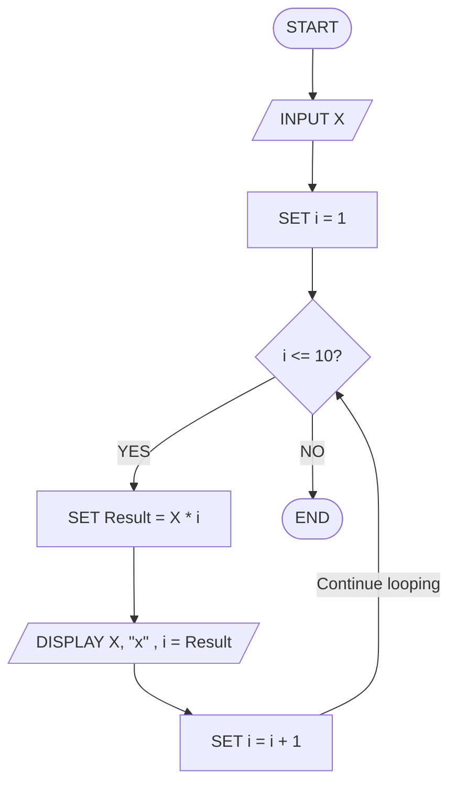

## 3. Positive, Negative, or Zero Check

Write the algorithm and flowchart to input a number and display whether
it is positive, negative, or zero.

### Pseudocode

```
START

    INPUT X

    IF X > 0 THEN
        DISPLAY "Positive"
    ELSE IF X < 0 THEN
        DISPLAY "Negative"
    ELSE
        DISPLAY "Zero"

END
```

### Flowchart

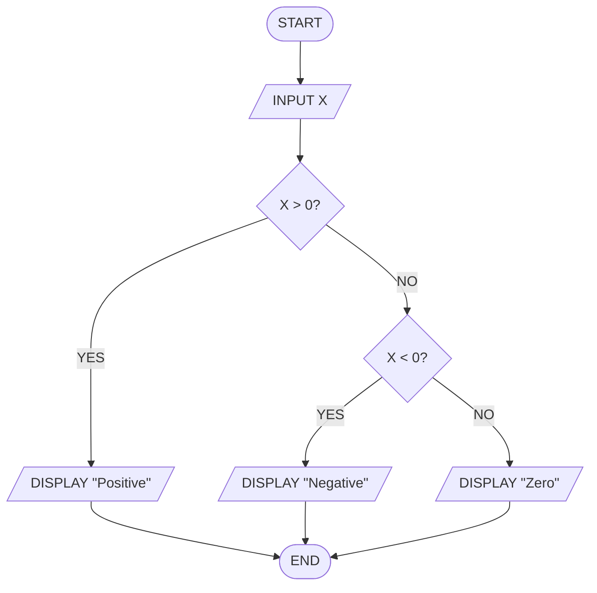

## 4. Simple Interest Calculator

Create an algorithm and flowchart for a program that calculates simple
interest using the formula:

**SI = (P × R × T) / 100**

- **P = Principal** → original amount of money
- **R = Rate of Interest** → percentage per year
- **T = Time** → number of years


### pesudocode
```
START

    INPUT P, R, T

    SET SI = (P * R * T) / 100

    DISPLAY SI

END

```
### Flowchart

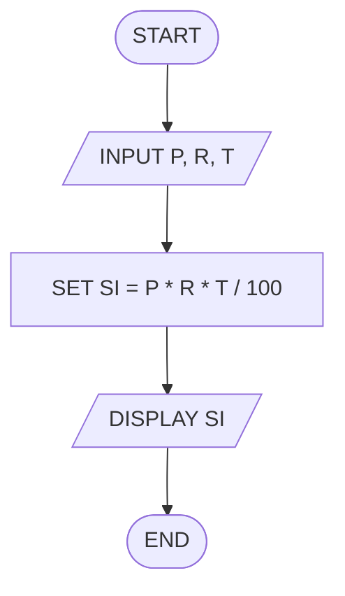

## 5. Average Temperature Calculation

Write the algorithm and draw the flowchart for a program that takes the
temperature of 7 days, finds the average temperature, and displays it.
### Pesudocode
```
START

    SET Total = 0

    FOR Day = 1 TO 7
        INPUT Temperature
        SET Total = Total + Temperature
    END FOR

    SET Average = Total / 7

    DISPLAY Average

END
```

### Flowchart

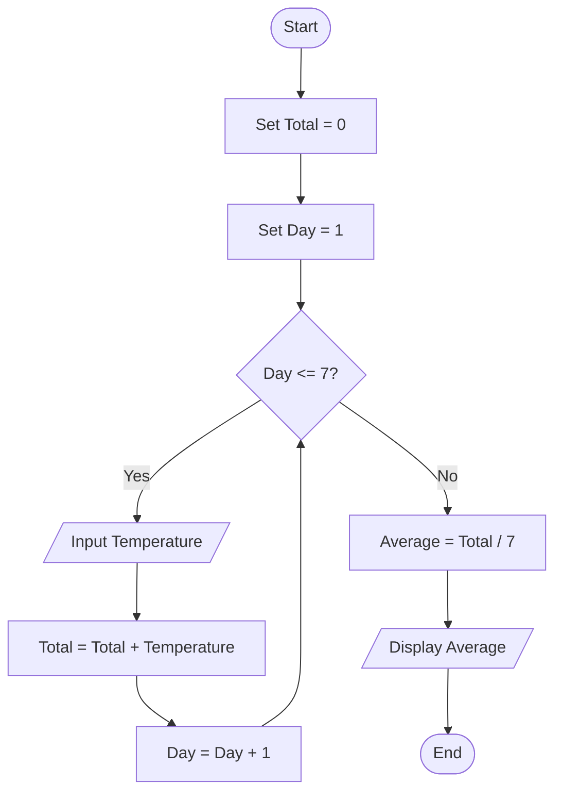

## 6. Calculate Area of a Rectangle

Create an algorithm and flowchart to input length and width, calculate
the area (**Area = Length × Width**), and display the result.


### pseducode
```
START

    INPUT Length, Width
    SET Area = Length * Width
    DISPLAY Area

END
```

### Flowchart

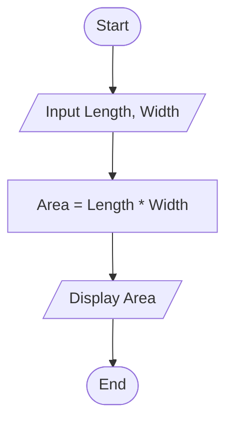

## 7. Determine Pass or Fail

Write the algorithm and draw the flowchart for a program that takes a
student's average marks and displays **"Pass"** if average ≥ 50,
otherwise **"Fail"**.

## pseducode

```
START

    INPUT Average

    IF Average >= 50 THEN
        DISPLAY "Pass"
    ELSE
        DISPLAY "Fail"
    END IF

END
```

## Flowchart


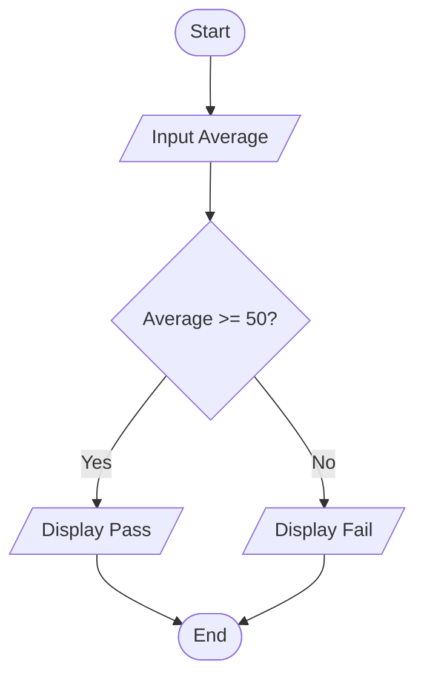

## 8. Calculate Factorial of a Number

Write the algorithm and draw the flowchart that input a number and
calculate its factorial using a loop.

### pseducode

```
START

    INPUT Number
    SET Factorial = 1

    FOR i = 1 TO Number
        SET Factorial = Factorial * i
    END FOR

    DISPLAY Factorial

END
```

### Flowchart


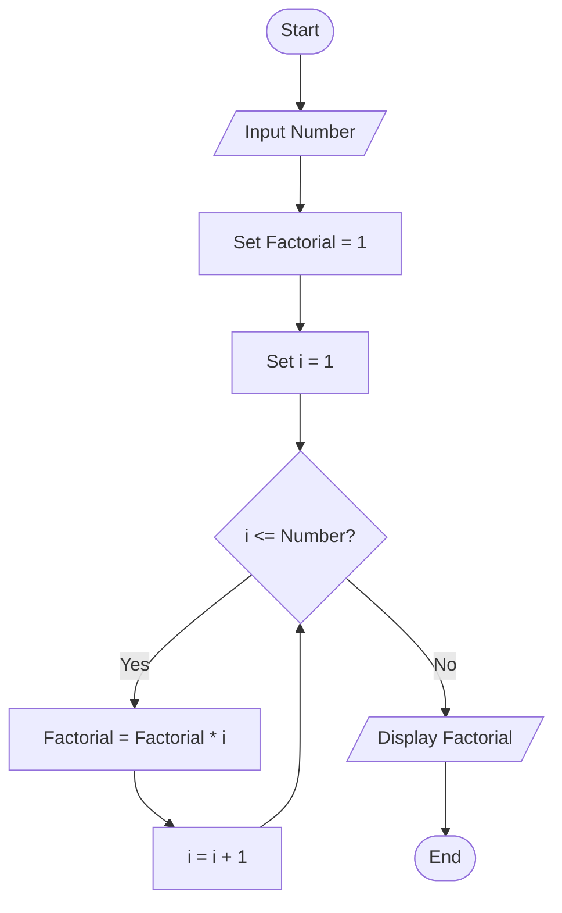

## 9. Calculate Discount on Purchase

Write the algorithm and draw the flowchart for a program that inputs the
purchase amount and gives a **10% discount** if the amount is greater
than 1000.

### Pesudocode

```
START

    INPUT PurchaseAmount

    IF PurchaseAmount > 1000 THEN
        SET Discount = PurchaseAmount * 0.10
        SET FinalAmount = PurchaseAmount - Discount
    ELSE
        SET FinalAmount = PurchaseAmount
    END IF

    DISPLAY FinalAmount

END
```
### Flowchart


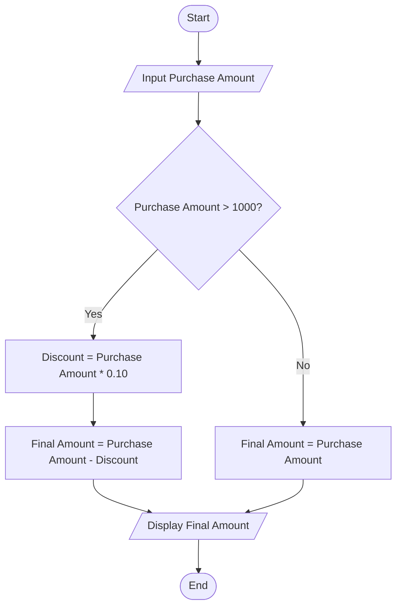


## Optional Exercises (11–16)

## 11. Online Shopping Delivery Eligibility

Write the algorithm and draw the flowchart for a program that inputs a
customer's purchase amount and displays **"Free Delivery"** if the
amount is 500 SEK or more; otherwise display **"Delivery Charge
Applies"**.

---

### Pseducode
```
START

    INPUT User-PurchaseAmount

    IF PurchaseAmount >= 500 THEN
        DISPLAY "Free Delivery"
    ELSE
        DISPLAY "Delivery Charge Applies"
    END IF

END
```
### Flowchart

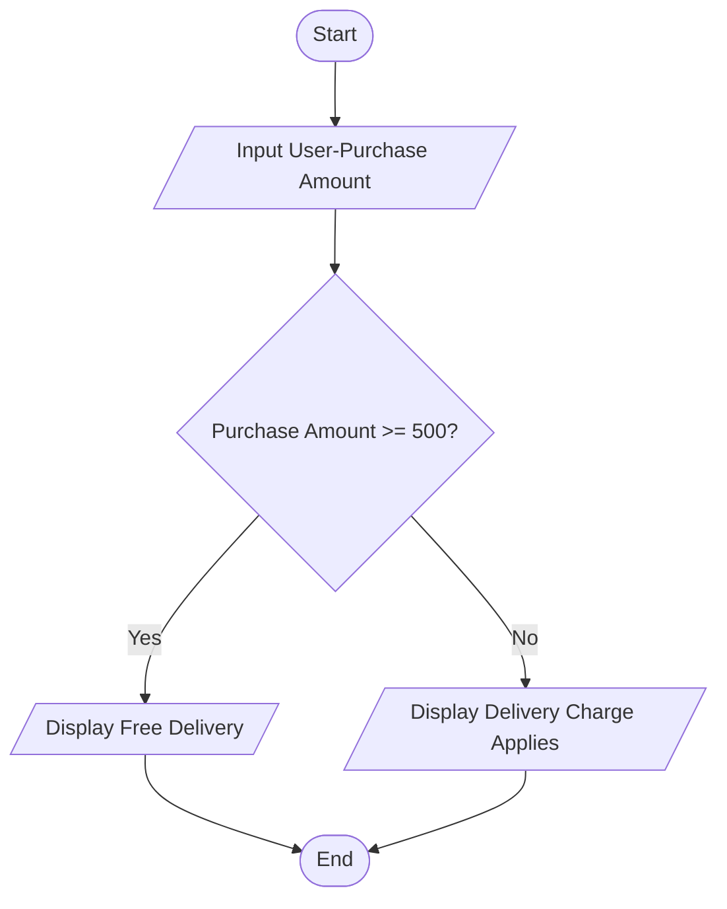

## 12. Employee Salary and Bonus Calculator

Write the algorithm and draw the flowchart for a program that inputs an
employee's monthly salary and years of service, calculates a bonus of
**10%** for employees with 5 or more years of service and **5%** for
others, then displays the bonus and total salary.


### Pseducode

```
START

    INPUT MonthlySalary, YearsOfService

    IF YearsOfService >= 5 THEN
        SET Bonus = MonthlySalary * 0.10
    ELSE
        SET Bonus = MonthlySalary * 0.05
    END IF

    SET TotalSalary = MonthlySalary + Bonus

    DISPLAY Bonus, TotalSalary

END

```
### Flowchart

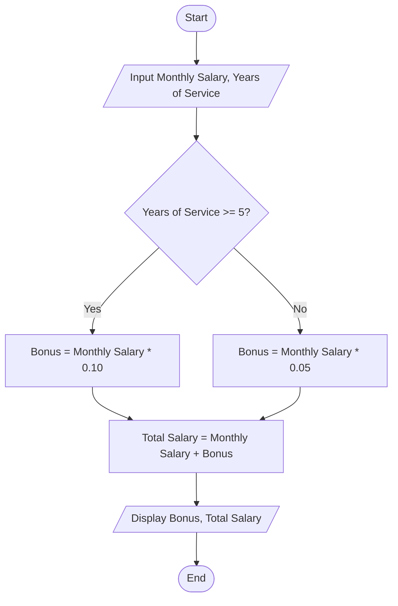


## 13. Mobile Data Usage Monitor

Write the algorithm and draw the flowchart for a program that inputs a
user's monthly data limit and data usage, then displays whether the user
has exceeded the limit or how much data remains.

### Pseducode

```
START
    INPUT MontlyDataLimit, DataUsage

    IF DataUsage > MonthlyDataLimit THEN
    DISPLAY "Exceeded Limit"
    Else
    SET RemainingData = MonthlyDataLimit -DataUsage
    DISPLAY RamainingData
    ENDIF
END

```

### Flowchart


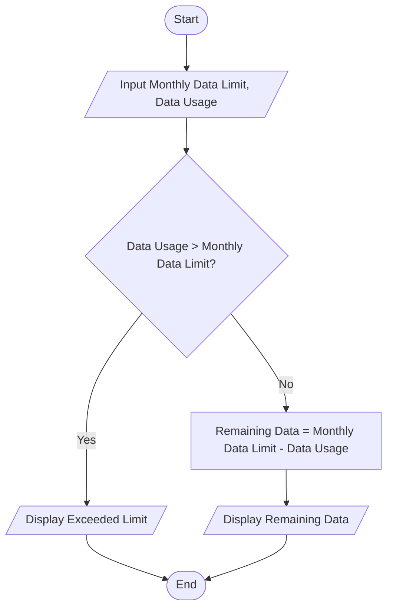

## 14. Login System (Maximum 3 Attempts)

Create an algorithm and flowchart for a login system that allows a user
up to 3 attempts to enter the correct password. Display **"Access
Granted"** if the password is correct; otherwise display **"Account
Locked"** after 3 failed attempts.

---

### Pseducode

```
START

    SET Attempts = 0

    WHILE Attempts < 3

        INPUT Password

        IF Password = CorrectPassword THEN
            DISPLAY "Access Granted"
            END
        ELSE
            SET Attempts = Attempts + 1
        END IF

    END WHILE

    DISPLAY "Account Locked"

END
```


